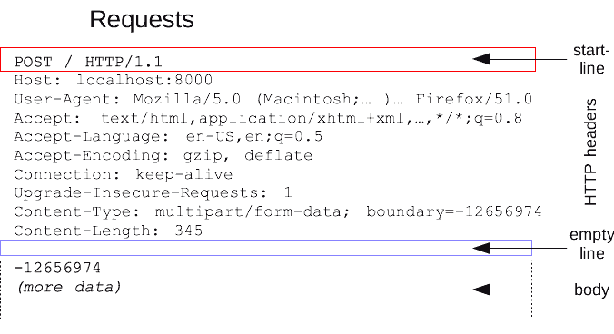
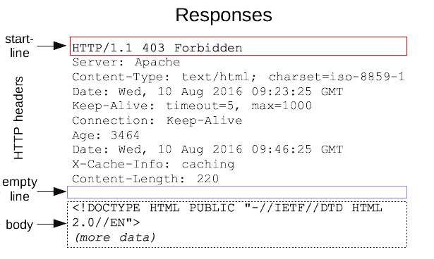

- [Hypertext Transfer Protocol (HTTP/1.1)](#hypertext-transfer-protocol-http11)
- [HTTP Messages](#http-messages)
  - [Requests](#requests)
    - [Request Start Lines](#request-start-lines)
    - [Request Headers](#request-headers)
    - [Empty Line](#empty-line)
    - [Request Body](#request-body)
    - [Simple HTTP Request Example](#simple-http-request-example)
  - [Responses](#responses)
    - [Response Status Lines](#response-status-lines)
    - [Response Headers](#response-headers)
    - [Empty Line](#empty-line-1)
    - [Response Body](#response-body)
    - [Simple HTTP Response Example](#simple-http-response-example)

# Hypertext Transfer Protocol (HTTP/1.1)

> this is to udnerstand about `req.body` and `res.body`

source: [HTTP Messages](https://developer.mozilla.org/en-US/docs/Web/HTTP/Messages)

HTTP requests, and responses, share similar structure and are composed of:

1. A start-line describing the requests to be implemented, or its status of whether successful or a failure. This start-line is always a single line.
2. An optional set of HTTP headers specifying the request, or describing the body included in the message.
3. A blank line indicating all meta-information for the request has been sent.
4. An optional body containing data associated with the request (like content of an HTML form), or the document associated with a response. The presence of the body and its size is specified by the start-line and HTTP headers.

# HTTP Messages

- HTTP 1.1 Message is **text-based**. Different sections are separated by line breaks.
- **HTTP Request Message and HTTP Response Message** have different formats.
- This section is only for you to better understand the theories. **We don’t need to parse a plain HTTP message, Express will handle it for us**.

HTTP messages are how data is exchanged between a server and a client. There are two types of messages: requests sent by the client to trigger an action on the server, and responses, the answer from the server.

The start-line and HTTP headers of the HTTP message are collectively known as the head of the requests, whereas its payload is known as the body.

Overall view of how Client and Server communicate:


## Requests

### Request Start Lines

-	HTTP requests are messages sent by the client to initiate an action on the server. Their start-line contain three elements:
  - HTTP method, like **GET**. (Will talk more about this in the the future)
  - The HTTP version, like **HTTP/1.1**
  - The request target, usually the URL/path, like (**/**)

- HTTP requests are messages sent by the client to initiate an action on the server. Their start-line contain three elements:
  - HTTP method, like GET. (Will talk more about this in the the future)
  - The HTTP version, like HTTP/1.1. (Consider it as a standard version nowadays)
  - The request target, usually the URL/path, like /. (Today focus)
      - Tell the server what do you want to get, for example
          - /background.png
              - Get an image from the server
          - /anypage.html
              - Get a HTML file from the server

### Request Headers

- HTTP Request headers are some key-value pairs to tell more about the HTTP message.
  - Host: It is like **the address to the server**.
  - Content-type: It tells **what kind of data is inside the HTTP body**.
  - Many more others...

### Empty Line

A blank line indicating all meta-information for the request has been sent.

### Request Body

- The message body contains **the actual data the client want to send**.
- You can put different data format in the HTTP request body. Some common examples are:
  - application/json
  - multipart/form-data



### Simple HTTP Request Example

There are many concepts about HTTP, let’s take a look at this simple example request:

```txt
GET /about HTTP1.1
Host: www.talentlabs.org
```

The above HTTP Request:
1.	Asks the backend application located at www.talentlabs.org to ...
2.	Gets HTML of the /about page.
3.	Contains an empty body, as no additional information is needed here.

## Responses

### Response Status Lines

- The start line of an HTTP response, called the status line, contains the following information:
  - The HTTP version, like HTTP/1.1.
  - The status code, like 403. (Will talk more about this in the the future)
  - The text version of the status code, like Forbidden. (Will talk more about this in the the future)

### Response Headers

- Similarly, HTTP response headers are some key-value pairs to tell more about the HTTP message.
  - Content-Type: what kind of data is inside the HTTP response body.

### Empty Line

A blank line indicating all meta-information for the request has been sent.

### Response Body

- The message body contain the **actual data the server want to reply**.
- You can put different data format in the HTTP response body. Some common examples are:
  - application/json
  - text/html



### Simple HTTP Response Example

There are many concepts about HTTP, let’s take a look at this simple example request:

```txt
HTTP1.1 200 OK
Content-Type: text/html
```

```html
<html>
 <body>
    <h1>About Page</h1>
 </body>
</html>
```

The above HTTP response is to reply the client with HTML text the client asked for.