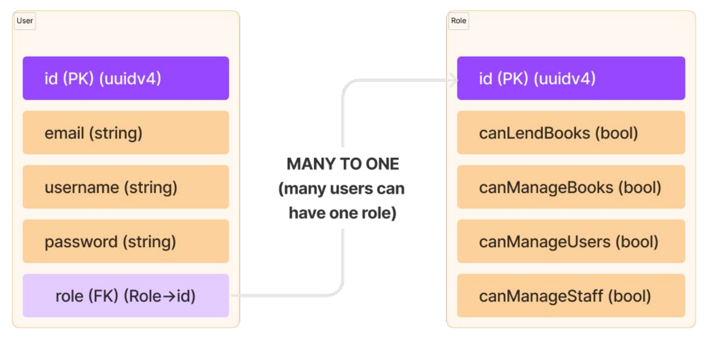
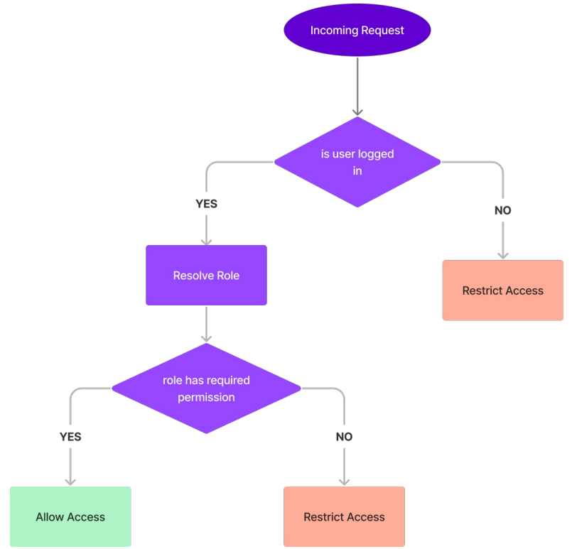

- [CONFIGURABLE ROLE BASED ACCESS - Section 8 (Notes)](#configurable-role-based-access---section-8-notes)
  - [WHAT IS AUTHORIZATION?](#what-is-authorization)
  - [THE ROLE AND USER SETUP](#the-role-and-user-setup)
  - [THE ACCESS CONTROL MIDDLEWARE](#the-access-control-middleware)

# CONFIGURABLE ROLE BASED ACCESS - Section 8 (Notes)

## WHAT IS AUTHORIZATION?

Authorization is restricting access to certain areas of the application for a user when the user’s identity is already known to the server.

For example, the server might know that jake@example.com is logged in, therefore jake shall be allowed to access his orders, while linda@anotherwebsite.com is an admin and she shall be able to see everyone’s orders and the financial records, while Jake shall not be allowed to.

Authorization is typically implemented by guard middleware, which make sure that when the user makes the request, they have enough permission to actually be able to call that route or execute that method.

## THE ROLE AND USER SETUP

To start setting up our permissions, let’s say we want to be able to configure which user is allowed actually manage books and which user has permission to manage staff users or regular users, to set this, we will create a new Roles Model where each Role would have a few permissions that can be configured as true or false and each role can be assigned to multiple users.

## THE ACCESS CONTROL MIDDLEWARE

The access control middleware would come into any request which needs elevated permissions and will restrict access accordingly.

- Incoming request is intercepted, and it is ensured that the identity of the user is known to the server
- If the identity is known, then the linked role is resolved.
- The role is now checked to make sure that it has the permission which is needed, if the permission is set to true, then the user is allowed through otherwise the request is rejected.

